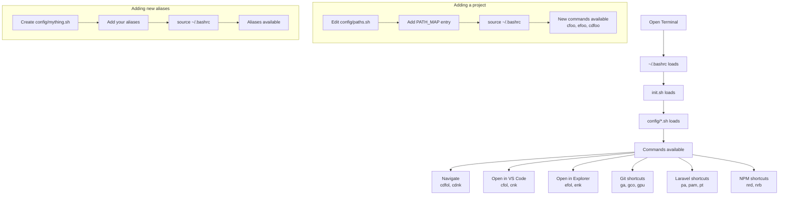

# Scriptit

Shell scripts, aliases, and shortcuts to navigate faster and work smarter.

## Quick Start

-------------------------------------------------------------------------------

**Step 1 — Clone the repo**

Clone Scriptit into your Windows home folder using Git Bash:

```bash
git clone git@github.com:naykel76/scriptit.git ~/scriptit
```

> Scriptit lives on Windows at `C:\Users\YOUR_USERNAME\scriptit`. Both Git Bash
> and WSL will access it from here.

-------------------------------------------------------------------------------

**Step 2 — Create your `.env` file**

```bash
cp ~/scriptit/.env.example ~/scriptit/.env
```

Open `.env` and fill in your personal details (server IP, SSH user etc).

-------------------------------------------------------------------------------

**Step 3 — Add Scriptit to your Git Bash `.bashrc`**

Open `~/.bashrc` in Git Bash and add the following:

```bash
# Base directory for projects and scripts.
export BASE="/c/Users/YOUR_USERNAME"

# scriptit entry point
if [ -f "$BASE/scriptit/init.sh" ]; then
    source "$BASE/scriptit/init.sh"
fi
```

-------------------------------------------------------------------------------

**Step 4 — Add Scriptit to your WSL `.bashrc`**

Open `~/.bashrc` in WSL and add the following. Note that paths use the
`/mnt/c/` prefix to access the Windows file system:

```bash
# Base directory for projects and scripts.
export BASE="/mnt/c/Users/YOUR_USERNAME"

# scriptit entry point
if [ -f "$BASE/scriptit/init.sh" ]; then
    source "$BASE/scriptit/init.sh"
fi
```

-------------------------------------------------------------------------------

**Step 5 — Reload**

```bash
source ~/.bashrc
```

Reloads your shell so all changes take effect immediately without closing the
terminal.

-------------------------------------------------------------------------------

## Troubleshooting

### Line ending issues

If you encounter `command not found` or `unexpected end of file` errors, it is
likely a line ending issue. Fix it by running:

```bash
bash ~/scriptit/scripts/fix-line-endings.sh
```

This converts CRLF to LF for all `.sh` and `.env` files in your Scriptit
directory.

### Common issues

- **Scripts not found:** Ensure `init.sh` is being sourced in your `~/.bashrc`
- **Permission denied:** Make scripts executable with `chmod +x ~/scriptit/scripts/*.sh`

-------------------------------------------------------------------------------

## Usage

### How it works

Scriptit is built around a simple principle — any `.sh` file placed in
`~/scriptit/config/` is automatically loaded when your shell starts. No other
changes needed.

```
~/.bashrc → init.sh → config/*.sh → your commands
```

### Workflow


